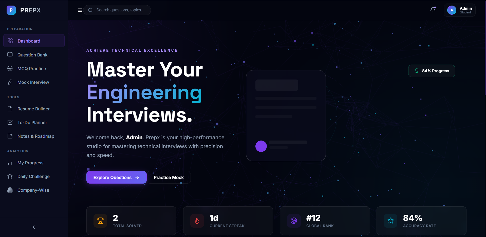

# PREPX – Full-Stack Interview Preparation Platform

PREPX is a full-stack web application developed as a final year project to help students prepare for technical interviews and placement drives in a more organized and practical way. The platform combines interview preparation tools, progress tracking, mock interviews, resume building, and AI-based evaluation features into one system.

The main goal of this project is to provide students with a centralized platform where they can practice consistently, improve their technical knowledge, and monitor their preparation progress.



---

# Features

* User Authentication using JWT
* Dashboard with preparation statistics and progress tracking
* Question Bank for DSA, DBMS, Operating Systems, Computer Networks, and HR questions
* MCQ Practice Module
* Mock Interview System
* AI-based Answer Evaluation using rule-based logic
* Resume Builder
* To-Do Planner for daily preparation tasks
* Progress Analytics and Performance Tracking
* Responsive UI for desktop, tablet, and mobile devices

---

# Tech Stack

## Frontend

* React.js (Vite)
* React Router DOM
* TanStack React Query
* Framer Motion
* Three.js
* Lucide React
* CSS3

## Backend

* Node.js
* Express.js
* MongoDB with Mongoose
* JWT Authentication
* Helmet.js
* Express Rate Limit
* Winston Logger

---

# Project Structure

```bash
prepx/
├── frontend/
│   ├── public/
│   ├── src/
│   │   ├── components/
│   │   ├── pages/
│   │   ├── context/
│   │   ├── utils/
│   │   └── api/
│
├── backend/
│   ├── config/
│   ├── controllers/
│   ├── middleware/
│   ├── models/
│   ├── routes/
│   ├── services/
│   └── utils/
│
├── README.md
└── .gitignore
```

---

# Installation and Setup

## Prerequisites

Make sure the following are installed:

* Node.js
* MongoDB Atlas or Local MongoDB
* Git

---

## Backend Setup

```bash
cd backend
npm install
```

Create a `.env` file inside the backend folder:

```env
PORT=5000
MONGODB_URI=your_mongodb_connection_string
JWT_SECRET=your_secret_key
```

Run the backend server:

```bash
npm run dev
```

---

## Frontend Setup

```bash
cd frontend
npm install
npm run dev
```

Frontend will run on:

```bash
http://localhost:5173
```

---

# API Endpoints

| Method | Endpoint           | Description                |
| ------ | ------------------ | -------------------------- |
| POST   | /api/auth/register | Register a new user        |
| POST   | /api/auth/login    | Login user                 |
| GET    | /api/progress      | Fetch user progress        |
| GET    | /api/mock          | Get mock interview history |
| POST   | /api/ai/evaluate   | Evaluate answers           |
| PUT    | /api/resume        | Save resume data           |

---

# Repository Contents

This repository contains:

* Frontend source code
* Backend source code
* Project Report
* Presentation PPT
* IPR / Copyright Submission Proof

---

# Future Enhancements

* Voice-based AI mock interviews
* Leaderboard system
* Company-specific interview preparation
* Personalized preparation roadmap
* Email reminders and notifications

---

# Team Members

| Name                | Roll Number |
| ------------------- | ----------- |
| Kalash Thakur       | 2211985023  |
| Gaurav Sharma       | 2211985020  |
| Ruhael Singh        | 2211985042  |
| Mahikshit Choudhary | 2211985031  |

---

# Project Details

* Project Title: PREPX – Full-Stack Interview Preparation Platform
* Project Type: Final Year Major Project (IOHE)
* Department: Computer Science and Engineering
* University: Chitkara University
* Supervisor: Dr. Rajat Takkar
* Current Status: Completed and Working

---

# Conclusion

PREPX was developed to simplify placement preparation for students by combining multiple preparation tools into one platform. The project focuses on improving consistency, tracking performance, and providing a better preparation experience for technical interviews.

---

Developed as part of the Final Year Major Project Submission
© PREPX 2026
